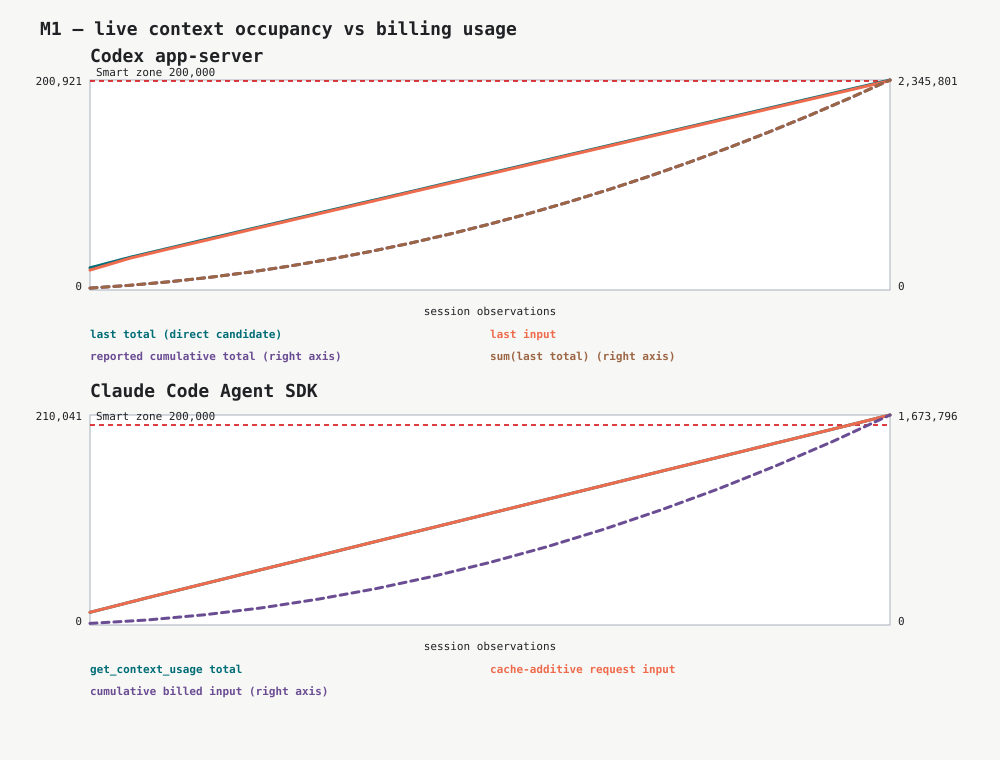

# M1 — current-context occupancy

## Decision this evidence informs

[Can both Harnesses report current context occupancy before compaction?](https://github.com/mcnewcp/my-team/issues/78): whether each Harness exposes a live absolute count that can trip the configurable Smart zone without confusing current context with cumulative billing usage.

## Reproduction identity

- Captured at: `2026-08-25T13:58:23.586167-05:00`
- Prototype commit used for the run: `d95615db6af5a38423e10a503e65f412951f2d40`
- Evidence rendered from commit: `ba4f33c6377ecc141098fafb9467a4c442ff637e`
- Host platform: `macOS-26.5.2-arm64-arm-64bit-Mach-O`
- Python: `3.13.5`
- Smart-zone trip count: `200,000` absolute tokens
- Workload: `35,400` read-only bytes per cycle from six fixed files; model-side tools disabled
- API-key environment: `CODEX_API_KEY absent; ANTHROPIC_API_KEY absent`
- Persistent Harness configuration changed: **no**

| Harness | Harness / SDK versions | Subscription-auth evidence | Effective model | Context window | Automatic compaction |
| --- | --- | --- | --- | ---: | --- |
| Codex | `codex-cli 0.149.1`; stable v2 schema `9b3de71a5a2ffc980b792a18aa8f8dec3f85f48829560222a0264fe494b679a9` | account type `chatgpt`, plan `plus` | `gpt-5.6-sol`, reasoning `xhigh` | `258,400` | configured limit `null`, scope `null`; Harness defaults remained in force |
| Claude Code | SDK `0.2.144`; bundled CLI `2.1.239`; standalone `2.1.243 (Claude Code)` | `claude.ai` via `firstParty`; API-key source `null` | `claude-opus-5[1m]` | effective `1,000,000`, raw `1,000,000` | enabled `true`, threshold `967,000` |

## Procedure

```text
cd prototypes/context-chaining
./run-safe occupancy.py --target 200000 --max-cycles 40
./run-safe render_occupancy.py
```

The runner opened one ephemeral session per Harness from the same empty temporary directory. Each cycle embedded the same repository bytes in the same order and required the same compact comparison. Codex ran with `approvalPolicy=never`, a read-only sandbox, empty explicit instructions, and no discovered instruction sources. Claude ran with no tools and no setting sources. Every client request, server event, direct-usage response, timestamp, source, and full raw payload was appended to local JSONL.

Claude per-request input arithmetic came from `ResultMessage.usage.iterations (re-derived from raw trace)`. The SDK emitted two AssistantMessage envelopes with identical usage for each API iteration in the captured run; those repeated envelopes remain in the raw trace but are not double-counted as requests.

A sharp occupancy drop was defined before the run as both at least `10,000` tokens and at least `20%` of the prior direct observation.

## Expected observation

M1 passes only if Codex `last.totalTokens` and Claude `get_context_usage().totalTokens` behave like live absolute current-context counts, cross `200,000` before any compaction drop, and remain distinguishable from cumulative billing arithmetic. A direct signal that resets before the Smart zone, never advances, or only mirrors cumulative billed usage fails the kill gate.

## Observations



### Codex

- `last.totalTokens` crossed the Smart zone in cycle 21 at `2026-08-25T14:03:46.999488-05:00` (`200,921` tokens); `last.inputTokens` crossed in cycle 21 at `2026-08-25T14:03:46.999488-05:00` (`200,303` tokens).
- Reported cumulative `total.totalTokens` crossed in cycle 5 at `2026-08-25T14:00:08.957144-05:00` (`200,348` tokens); independently summing every `last.totalTokens` crossed in cycle 5 at `2026-08-25T14:00:08.957144-05:00` (`200,348` tokens).
- The final notification reported `last.totalTokens=200,921`, `last.inputTokens=200,303`, `last.cachedInputTokens=190,208`, reported cumulative `total.totalTokens=2,345,801`, and derived cumulative `2,345,801`.
- No sharp occupancy drop was observed. The observed model window was `258,400` tokens.

### Claude Code

- `get_context_usage().totalTokens` crossed the Smart zone in cycle 15 at `2026-08-25T14:08:14.410143-05:00` (`210,041` tokens).
- Cache-additive request input (`input_tokens + cache_creation_input_tokens + cache_read_input_tokens`) crossed in cycle 15 at `2026-08-25T14:08:14.410143-05:00` (`210,041` tokens); cumulative billed input crossed in cycle 5 at `2026-08-25T14:05:26.608591-05:00` (`206,074` tokens).
- The final observation reported direct context `210,041`, cache-additive request input `210,041`, and cumulative billed input `1,673,796`.
- No sharp occupancy drop was observed. Auto-compaction remained enabled at `967,000` within the raw `1,000,000`-token window.

## Trace inventory

Raw JSONL remains local and untracked.

| Harness | Local path | SHA-256 | Sanitization notes |
| --- | --- | --- | --- |
| Codex | `local/traces/20260825-135823-586144-codex-occupancy.jsonl` | `77b739a5925faabc0ca94ed43784a5576df289ad61fa93320d588367949126e3` | none; full raw payload is local only |
| Claude Code | `local/traces/20260825-135823-586144-claude-occupancy.jsonl` | `84af8d678e11274118250fbb4b156c98dc68bb78275cbd2d36c93019650fba7b` | none; full raw payload is local only |

## Result

- Outcome: **pass**
- Evidence-backed finding: Codex `last` and Claude `get_context_usage().totalTokens` each supplied a live absolute signal that reached the `200,000`-token Smart zone before automatic compaction, while cumulative usage crossed substantially earlier and therefore cannot stand in for occupancy.
- Remaining uncertainty: this run does not establish signal cadence during an in-flight request, behavior at either Harness's automatic-compaction boundary, context-quality calibration, interruption, Handoff, continuation, or real skill dispatch.
- Kill-gate decision: **proceed to Product Owner review**. No interruption or chaining work was performed.

## Consequences for the map

If the Product Owner accepts M1, both direct signals can anchor the next interruption milestone. The fallback to live Codex rollout JSONL was not needed. The open fog around an alternative occupancy path can be removed; compaction-boundary and supported-model constraints remain unresolved beyond this milestone.
